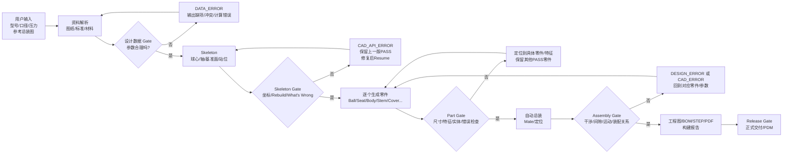

# Q347F 参数驱动阀门 3D 自动建模系统——总体架构与 Gate 流程 V1

> 目标：从“阀门型号 + 口径 + 压力等级 + 参考总装图 + 标准/材料/工况”出发，自动生成可编辑的 SolidWorks 零件、总装、工程图和交付资料。
>
> 本系统不是一次性画图宏，而是一个 **参数驱动、可校验、可断点续跑、可增量重建的 CAD Build System**。

---

## 1. 一句话理解

```text
用户输入
  ↓
把参考图和标准变成“设计数据”
  ↓
把设计数据变成“Skeleton骨架”
  ↓
基于Skeleton逐个生成零件
  ↓
自动装配
  ↓
干涉/尺寸/运动/错误检查
  ↓
输出3D模型、工程图、BOM和报告
```

核心原则：**每一步都必须经过 Gate 校验；失败只停当前阶段，不污染上一版 PASS 结果，并允许修复后 Resume。**

---

## 2. 老板/设计/开发都能看懂的总流程



---

## 3. 五层架构

### 3.1 设计数据层 Design Data Layer

负责回答：**“这个阀门应该是什么？”**

数据包括：

- 阀门型号、口径、压力等级、结构形式；
- 尺寸参数；
- 装配关系；
- 空间坐标；
- 材料；
- 标准；
- 参数状态（D / C / H-R 等）；
- 参数来源与版本。

典型数据：

```text
BALL_OD = 465
BORE_D = 303
X_BODY_JOINT_CAD = 232.5
Z_BODY_TOP_IF_CAD = 264.5
```

这一层 **不能直接写 SolidWorks API**。

长期允许数据来自 TXT / Excel / 数据库 / Web 后台，运行时统一转换成内部 `DesignModel`。

---

### 3.2 CAD 语义层 CAD Semantic Layer

负责回答：**“这些数字在工程上分别代表什么？”**

不建议后续代码到处使用裸数字 `232.5 / 264.5 / 465`，而应建立语义对象：

```text
BALL_CENTER
FLOW_AXIS
SUPPORT_AXIS
BALL_LEFT
BALL_RIGHT
BODY_JOINT
BODY_TOP_INTERFACE
BODY_BOTTOM_INTERFACE
F25_INTERFACE
STEM_TOP
```

例如：

```text
BODY_JOINT.X = +232.5
BODY_TOP_INTERFACE.Z = +264.5
```

以后零件建模与装配都引用这些语义对象，而不是重新猜数字含义。

---

### 3.3 SolidWorks 适配层 SolidWorks Adapter

负责回答：**“如何把语义模型真正变成 SolidWorks 特征？”**

正式技术路线：

```text
BAT
↓
64位 Windows PowerShell
↓
内嵌 C#
↓
SolidWorks.Interop.sldworks.dll
+ SolidWorks.Interop.swconst.dll
↓
SolidWorks 2025 COM API
```

职责建议拆成：

```text
SwSession       连接/启动SolidWorks
SwDocument      Part/Assembly/Drawing生命周期
SwEquation      全局变量/方程
SwGeometry      基准面/轴/点/草图
SwFeature       Revolve/Cut/Extrude/Hole等
SwAssembly      Mate/组件定位
SwValidation    坐标/尺寸/Rebuild/What's Wrong
SwSave          staging/backup/publish
```

原则：复杂 COM 强类型转换尽量在 C# 内完成，PowerShell 负责流程控制。

---

### 3.4 阶段构建层 Build Orchestrator

负责回答：**“整个阀门按什么顺序构建？”**

统一阶段建议：

```text
S00 环境检查
S01 参数读取与设计数据校验
S02 连接 SolidWorks
S03 Skeleton
S04 Ball
S05 Seat
S06 Body
S07 Body Cover
S08 Stem / StemCover / BottomCover
S09 Adapter / F25 / 其他附件
S10 自动总装
S11 干涉 / 运动 / 装配综合校验
S12 工程图 / STEP / BOM / 报告 / Release
```

每个 Stage 都必须具备：

- 输入条件；
- 依赖阶段；
- RUNNING / PASS / WARN / FAIL / BLOCKED / SKIP；
- staging 输出；
- Validator；
- Resume 能力。

---

### 3.5 校验与发布层 Validation & Release

负责回答：**“什么才算真的建好了？”**

不能以“文件保存成功”为 PASS。

一个 Part 至少要检查：

```text
关键特征存在
+
关键尺寸正确
+
关键坐标正确
+
SolidBody数量正确
+
ForceRebuild通过
+
What's Wrong无Error
+
staging保存成功
+
正式发布成功
```

Assembly 还要增加：

```text
组件齐全
Mate状态正确
干涉检查
关键间隙
运动范围
装配关系回读
```

---

## 4. Gate：实际项目最重要的机制

系统不是一条必然成功的直线，而是一组“关卡”。

### Gate 1：INPUT / DESIGN GATE

输入：型号、压力、图纸、标准、材料。

检查：

- 参数是否缺失；
- 规格是否冲突；
- 公式能否计算；
- 几何逻辑是否成立；
- 标准匹配是否正确。

失败：直接 `DATA_ERROR`，**此时不应该启动 SolidWorks**。

### Gate 2：SKELETON GATE

检查：

- 球心 O；
- FLOW / SUPPORT 主轴；
- X/Z station planes；
- 世界坐标回读；
- Rebuild；
- What's Wrong。

Skeleton 一旦 PASS，就作为所有零件的共享定位基准。

### Gate 3：PART GATE

每个零件独立校验。

例如 Ball：

```text
BALL_OD
BORE_D
BALL_W_X
上支承孔
驱动槽
下支承孔
实体数量
Feature树
Rebuild
What's Wrong
```

某个零件失败时，只停止该零件；其他已 PASS 零件不受污染。

### Gate 4：ASSEMBLY GATE

检查：

- Mate；
- 组件坐标；
- 干涉；
- 间隙；
- 运动；
- 接口关系。

失败时必须能追溯到“具体零件 + 具体接口 + 具体参数”。

### Gate 5：RELEASE GATE

只有全部工程检查通过，才输出正式：

- SLDPRT；
- SLDASM；
- SLDDRW；
- STEP / IGES；
- PDF；
- BOM；
- Build Report。

---

## 5. 三类错误必须分开

### DATA_ERROR

设计输入本身错误。

例：

```text
BORE > BALL
参数缺失
压力等级与法兰标准不匹配
```

处理人：设计数据/设计计算侧。

### CAD_API_ERROR

设计数据没有问题，但自动化代码失败。

例：

```text
Interop / COM
EquationMgr
InsertRefPlane
Feature API
类型转换
```

处理人：CAD 自动化开发侧。

### DESIGN_ERROR

CAD 能生成模型，但设计物理上不成立。

例：

```text
球体与阀座干涉
阀杆装不进去
O圈压缩量异常
壁厚不足
螺栓孔打穿
运动过程碰撞
```

处理人：阀门设计工程侧。

---

## 6. staging → validation → publish

每一个阶段都禁止直接覆盖正式 PASS 文件。

正确流程：

```text
生成 staging
    ↓
自动校验
    ↓
FAIL ──→ 保留staging和日志，正式文件不动
    ↓ PASS
备份 previous_PASS
    ↓
publish正式文件
```

这样某次新参数或新代码失败，不会把上一版好模型破坏掉。

---

## 7. Resume 与增量构建

最低要求：支持从失败阶段继续。

例如：

```text
S03 PASS
S04 PASS
S05 PASS
S06 FAIL
```

修复后：

```text
S03 SKIP
S04 SKIP
S05 SKIP
S06 Resume
```

长期应进一步升级为依赖图：

```text
BALL参数变化
  ↓
BALL = STALE
ASSEMBLY = STALE
DRAWING = STALE

SEAT / STEM若无依赖变化，则保持PASS
```

也就是像软件编译一样进行 **Incremental Build**。

---

## 8. 推荐项目目录

```text
SolidWorks_AutoBuild_Q347F_12in/
├─ 00_config/
│  └─ build_config.json
├─ 01_design_data/
│  ├─ skeleton.json
│  ├─ ball.json
│  ├─ seat.json
│  ├─ body.json
│  └─ assembly.json
├─ 02_scripts/
│  ├─ Build_Q347F_12in.ps1
│  ├─ core/
│  │  ├─ Logger.ps1
│  │  ├─ State.ps1
│  │  ├─ Config.ps1
│  │  └─ ParameterLoader.ps1
│  ├─ sw/
│  │  ├─ SwSession.ps1
│  │  ├─ SwDocument.ps1
│  │  ├─ SwEquation.ps1
│  │  ├─ SwGeometry.ps1
│  │  ├─ SwFeature.ps1
│  │  ├─ SwAssembly.ps1
│  │  └─ SwValidation.ps1
│  └─ stages/
│     ├─ S00_Environment.ps1
│     ├─ S01_Parameters.ps1
│     ├─ S02_SolidWorks.ps1
│     ├─ S03_Skeleton.ps1
│     ├─ S04_Ball.ps1
│     └─ ...
├─ 03_output/
│  ├─ parts/
│  ├─ assembly/
│  └─ drawings/
├─ 04_work/staging/
├─ 05_backup/
├─ 06_logs/
└─ 07_reports/
```

当前仓库可逐步迁移到该结构，不需要为了目录整洁一次性重构全部已验证代码。

---

## 9. Git / PDM 边界

Git 长期保存：

```text
程序源码
设计参数定义
配置模板
设计规则
测试样例
架构/流程文档
```

Git 不建议长期堆积：

```text
每次run日志
staging
backup
大量临时SLDPRT/SLDASM
```

长期推荐：

```text
Git = 代码 + 数字设计定义
PDM/PLM = 正式CAD工程文件和发布版本
```

---

## 10. 当前路线的里程碑意义

当前 S00～S03 的真实运行已经证明最关键的一条主链成立：

```text
尺寸参数
+ 装配关系
+ 空间坐标
       ↓
   Skeleton
       ↓
世界坐标回读
       ↓
Rebuild / What's Wrong
       ↓
正式SLDPRT发布
```

后续 Ball、Seat、Body 等都应复用同一套：

```text
Build → Validate → Publish → Resume
```

而不是重新写一套零散宏。

---

## 11. 最终产品形态

未来系统真正的入口应非常简单：

```text
用户：
Q347F
12in
Class150
参考总装图
材料/标准/工况

        ↓

系统：
解析 → 计算 → Skeleton → Parts → Assembly → Validation → Drawing

        ↓

输出：
可编辑SolidWorks源文件 + STEP + 工程图 + BOM + 校验报告
```

**最终目标不是“AI帮工程师手工画阀门”，而是“设计数据驱动 CAD 自动构建，并在失败时能定位、回退和继续”。**
